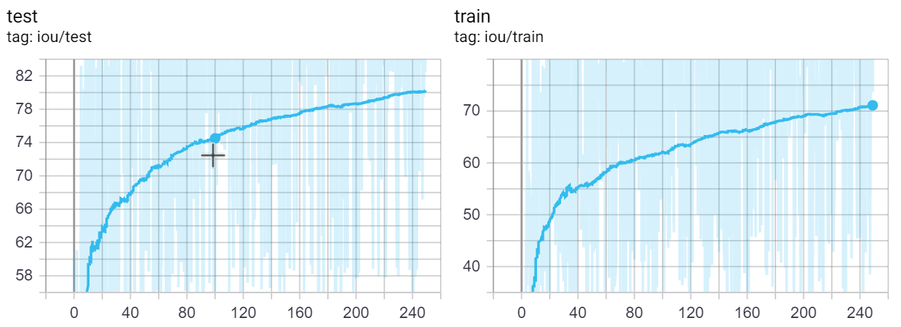
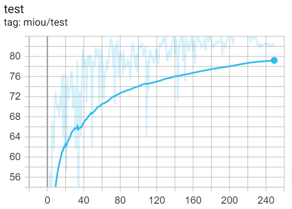

# License Plate Segmentation


## Table of contents

* [Table of contents](#table-of-contents)
* [Quick start](#quick-start)
* [Pretrained models](#pretrained-models)
* [Example notebooks](#example-notebooks)
  + [*Sample detection pipeline*](#sample-detection-pipeline)
  + [*License Plate tracking in video streams*](#license-plate-tracking-in-video-streams)
* [Motivation and future plans](#motivation-and-future-plans)
* [Train with your own data](#train-with-your-own-data)
* [References](#references)

## Quick start

1. Install all dependencies:
    ```bash
    # With conda - best to start in a fresh environment:
    conda install --yes pytorch torchvision cudatoolkit=10.1 -c pytorch
    conda install --yes opencv
    conda install --yes matplotlib
    conda install --yes -c conda-forge tensorboard
    pip install mmcv
    
    # or clone this repo, removing the '-' to allow python imports:
    git clone https://github.com/dennisbappert/pytorch-licenseplate-segmentation pytorch_licenseplate_segmentation
    
    # Get started with the sample notebooks
    ```
2. Making predictions:
    ```python
    # Load the model:
    model = create_model()
    checkpoint = torch.load(weights, map_location='cpu')
    model.load_state_dict(checkpoint['model'])
    _ = model.eval()
    
    if torch.cuda.is_available():
      model.to('cuda')
    
    # Prediction pipeline
    def pred(image, model):
      preprocess = transforms.Compose([
          transforms.ToTensor(),
          transforms.Normalize(mean=[0.485, 0.456, 0.406], std=[0.229, 0.224, 0.225]),
      ])

      input_tensor = preprocess(image)
      input_batch = input_tensor.unsqueeze(0)

      if torch.cuda.is_available():
          input_batch = input_batch.to('cuda')

      with torch.no_grad():
          output = model(input_batch)['out'][0]
          return output
          
    # Loading an image
    img = Image.open(f'{filename}').convert('RGB')
    
    # Defining a threshold for predictions
    threshold = 0.1 # 0.1 seems appropriate for the pre-trained model
    
    # Predict
    output = pred(img, model)

    output = (output > threshold).type(torch.IntTensor)
    output = output.cpu().numpy()[0]
    
    # Extracting coordinates
    result = np.where(output > 0)
    coords = list(zip(result[0], result[1]))
    
    # Overlay the original image
    for cord in coords:
        frame.putpixel((cord[1], cord[0]), (255, 0, 0))
    ```
    
## Pretrained models

The following models have been pretrained (with links to download pytorch state_dict's):

|Model name|mIOU|Training dataset|
| :- | :-: | -: |
|[model.pth](https://tobe.done) (477MB)|82.27|Handcrafted

The base weights are from [here](https://pytorch.org/hub/pytorch_vision_deeplabv3_resnet101/).

The model has been trained (transfer learning) on a small hand-crafted (130 images) dataset. Several augmentations were used during each epoch to ensure a good generalization of the model. However there are certain underrepresented classes (motorcycles, busses, american trucks).

The learning process has been adapted from the original [training](https://github.com/pytorch/vision/blob/master/references/segmentation/train.py) with the following changes:
- The learning rate has been decreased to 0.001 as starting point
- [Lovasz Softmax](https://github.com/bermanmaxim/LovaszSoftmax) has been used instead of cross entropy loss
- More augmentations were added to the pipeline

The model has been trained on a RTX2060 Super with a batch-size of 2 for 250 Epochs (8 hours training time) on a Windows machine with an eGPU.

The attached [YouTube video](https://www.youtube.com/watch?v=WHlubxp07J4) shows the strength and weaknesses of the current model:
- It works quite good overall, even with yellow plates (it never saw them before, the color jitter transformation did a good job)
- It works in blurry areas (gaussian transformation applied during training)
- It doesn't work with trucks and and vans (I should modify my training dataset accordingly to include these classes more balanced)

## Example notebooks
### Sample detection pipeline [link](/examples/make-predictions.ipynb)
This notebook demonstrates how you can leverage the model to make predictions on single images. 
### License Plate tracking in video streams [link](/examples/process-video.ipynb)
This notebook demonstrates how you can leverage the model to overlay license plates in videos. This is just an example and loads all frames into memory which is not optimal for big videos. Also there is no resizing applied, which means that you need a beefy GPU with at least 8GB of memory for HD videos.

### Training results




## Motivation and future plans

I basically started this project out of couriosity to improve my skillset. In particular I wanted to examine whether it is possible to solve an image segmentation problem with a very small dataset and I think I have been somewhat successful so far. I'm pretty new in this domain and appreciate all feedback, having that said, feel free to open as many issues as required.

I'm planning to do the following things in future:
- [ ] Publish the code and all the Notebooks
- [ ] Write a proper README
- [ ] Upload the model
- [ ] Implement license plate recognition (I'm planning to evaluate CRAFT)
- [ ] Build a simple commandline tool to blur license plates in videos (it seems that there is no open-source version available)

## Train with your own data

By default the dataloader expects the following structure:
* train.py
* ./dataset
    * ./val
        * images
            * {filename}.jpg
        * masks
            * {filename}.jpg.png
    * ./train
        * images
            * {filename}.jpg
        * masks
            * {filename}.jpg.png

Feel free to change the dataloader to your needs. The masks are expected to be a PNG using 8-bit pixels, black and white. The training outputs a tensorboard summary to `./runs/`.

The data should look like this:


## References

1. Pytorch DeepLabV3 ResNet-101 implementation and weights [https://pytorch.org/hub/pytorch_vision_deeplabv3_resnet101/](https://pytorch.org/hub/pytorch_vision_deeplabv3_resnet101/)

2. Lovasz Softmax Loss function [https://github.com/bermanmaxim/LovaszSoftmax](https://github.com/bermanmaxim/LovaszSoftmax)

3. Pytorch reference implementation to train the model [https://github.com/pytorch/vision/tree/master/references/segmentation](https://github.com/pytorch/vision/tree/master/references/segmentation)

4. Example videos [https://www.pexels.com/](https://www.pexels.com/)
